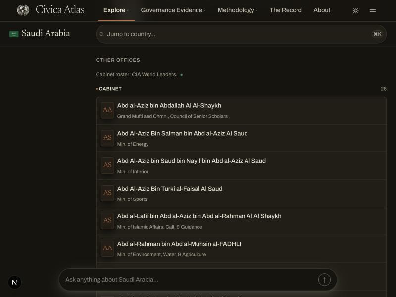

# DAT-037: CIA World Leaders cabinet-term integrity

Status: completed on 2026-09-29. The corrected importer and reader shipped in
PR #43, the owner-approved one-time repair ran on production after a full
refresh, and every postflight check passed with a zero-change repeat plan
(see "Production application, 2026-09-29" below and
[`production-repair-2026-09-29.json`](production-repair-2026-09-29.json)).
Two isolated rehearsals came first: the first (2026-09-28) found two rows the
repair did not reach and a hand-entered date it should have kept; the repair
was fixed, and the second (2026-09-29) passed every check. The owner approved
applying the repair as rehearsed, with no public correction record:
[`OWNER-APPROVAL-2026-09-29.md`](OWNER-APPROVAL-2026-09-29.md) and APR-D173 in
`plan/DECISIONS.md`.

## The defect

The CIA World Leaders directory publishes each country's titles, the people
holding them, and one page-level "Last Updated" date. It publishes no
appointment dates. The former importer:

- stored the page date as every minister's `terms.start_date` and used that
  date as part of the term's identity, so each page update stored unchanged
  ministers again (read-only snapshot, 2026-09-28: about 247 office/person
  pairs with 280 excess rows);
- kept only the last holder of a title the page lists several times (12 Saudi
  Ministers of State shown as 1 current and 11 former);
- never retired titles or holders the page stopped listing (Hungary, Peru,
  Taiwan, Venezuela), and left the dropped title in its list position, so a
  new title landing there tripped the office identity guard (Samoa on 21
  September; Uganda, Ukraine, and the United Kingdom on 25 September);
- imported CIA's "Vacant" placeholder as a person holding 17 current posts;
- rewrote every office, statement, and body on every run (about 3,500 no-op
  history rows in ten days).

DAT-028's statement repair also left about 160 cabinet terms without
provenance and 57 statements naming another title, because the original
writer had keyed one statement per person.

## What the code changes

Importer (`src/lib/factbook/cia-cabinets-sync.ts`, pure rules in
`src/lib/factbook/cabinet-roster.ts`):

- A term is identified by office and person. No start or end date is ever
  written.
- Each listed title's current holders become exactly the listed people,
  including every holder of a multi-seat title. Duplicate stored rows resolve
  to one shared survivor (CIA provenance, then current, then latest CIA
  retrieval, then latest stored date, then lowest id).
- A title the page no longer lists releases its list position and its holders
  become former holders. Nothing is deleted. New titles therefore never
  collide with a stale position.
- "Vacant" and its variants mean no holder. "Chancellor of the Exchequer" and
  "Chancellor of the Duchy of Lancaster" are classified as cabinet posts.
- People match on exact name in a fixed order: someone already holding this
  office, then someone holding another roster office in the country, then
  anyone holding an office in the country, then a QID-backed person, then
  anyone. More than one match at the deciding tier fails that country closed.
- Each country commits in one Neon transaction (offices, people, terms,
  statements, roster statement, and a final assertion that every listed and
  released office ended in its planned position).
- The page date is one `cabinet_roster_last_updated` statement on the
  executive body, with a SHA-256 of the normalized roster in `source_hash`,
  written only when the date or content changes.
- An unchanged roster writes nothing, records no history, and does not stamp
  freshness. The cron outcome treats an unchanged shard as completed. The
  shared executive body is created when missing but never renamed (the
  officeholder sync names it from Wikidata; the old unconditional upsert
  renamed it back and forth).
- New closed skips: head-office title collision and duplicate stored titles
  (`office_identity_conflict`), ambiguous person
  (`person_identity_ambiguous`), implausible contraction and date regression
  (`roster_contraction_guard`, `roster_stamp_regressed`).

Reader:

- Government and Leaders never show a stored date on a roster office
  ("since", "Longest serving", tenure), before or after the repair.
- The Government chart shows every holder of a multi-seat roster title, hides
  titles the latest roster no longer lists, and credits "Cabinet roster
  updated <date>" with a CIA World Leaders source dot. Heads keep one card.
- Leaders credits the roster under "Other offices". Its footnote names
  Wikidata for heads and their dates, and names the CIA roster only where the
  country has roster rows; offices without a cited source are labeled as such.
- `/api/countries/[slug]/leaders`, `/structure`, and `/api/v1/countries/[code]`
  publish no stored date on roster offices, hide released titles, and pick the
  v1 `currentHolder` deterministically.

No Index change-control file was edited.

## One-time repair

`npm run repair:cabinet-terms` (`scripts/repair-cabinet-terms.ts`, logic in
`src/lib/factbook/cabinet-term-repair.ts`, registered as
`data-repair-cabinet-terms`, method `cabinet-term-integrity-repair/v2`). It
needs no inference about older rosters, because the corrected importer's live
refresh owns every current flag, list position, and term statement.

R1, R2, and R5 act on CIA-owned offices: offices the roster lists, offices
with a CIA statement on one of their terms, and offices whose list position the
importer released. The repair reads the release from the append-only evidence
ledger (an `offices` update whose before-state had a list position and whose
after-state has none), so releasing a title whose terms carry no CIA statement
cannot take that title out of scope. Categories:

| Step | Action |
| --- | --- |
| R1 | Delete terms held by the "Vacant" placeholder person, and their statements |
| R2 | Collapse duplicate office/person rows to the shared survivor; delete loser rows and their CIA statements (a loser with any other publisher's statement stops the plan) |
| R3 | Re-home a misplaced CIA or Wikidata statement to the term it describes, or delete it when that term already has its own; a statement with no single target stops the plan (never relabelled) |
| R4 | Retire unsourced legacy cabinet rows in a country whose executive body has an imported roster (the three UK rows); US legacy rows stay current and are labeled unsourced |
| R5 | Clear CIA page dates on surviving roster terms: the dates of a term that carries CIA provenance, and dates equal to one of the country's page stamps (a date its CIA-sourced roster terms carry, or carried before the repair removed it). A legacy hand-entered date is kept, also on a legacy office the importer adopted by its exact title |

Plan mode writes nothing. The plan holds IDs, row digests, category counts,
non-target fingerprints, and its own SHA-256; no names or payload text. Apply
runs that exact plan in one transaction: lock the cabinet tables, assert every
target is still in its before-state or already in its after-state, assert no
other cabinet row changed since the plan, apply guarded writes, assert the
after-state and the unchanged non-targets. Any mismatch rolls everything back.
Replaying an applied plan changes nothing. Apply requires one explicit
public-correction choice, recorded in the apply report:
`--public-correction=waived-prelaunch` (the owner's prelaunch waiver,
APR-D173) or `--correction-log-id=<uuid>` naming an existing `in_review`
correction record; any other value, both, or neither is refused. A
non-loopback host requires `--production-host`, the owner-approval file, and
`--confirm=APPLY-<first 12 characters of the plan SHA-256>`. The approval file
must be non-empty, name the method `cabinet-term-integrity-repair/v2`, contain
the full SHA-256 of the plan being applied, and record APR-D173 when the
waiver is used; the report records the file's own SHA-256. These checks live
in `src/lib/factbook/cabinet-repair-authorization.ts` and its tests.

Postflight (`--verify`): P1 no roster-typed term still holds a CIA page date
(legacy hand-entered dates are counted and disclosed); P2 no duplicate pairs;
P3 every current roster term has exactly one CIA statement naming its office
and country page (retired terms without provenance are counted and
disclosed); P4 no CIA statement on a head term and no Wikidata statement on a
roster term; P5 no placeholder terms; P6 every executive body with current
roster terms has one ISO roster date; P7 no current holder on a released
title and no shared list position; P8 a re-plan proposes nothing; P10 CIA
source freshness unchanged by the repair; P11 history rows recorded at the
transaction time equal the plan's expected count. P2, P3, P4, and P7 use the
repair's ownership rule. P1 and P5 check every roster-typed term in an
executive body, inside or outside that rule, so a gap in the repair's scope
fails the postflight instead of passing unseen. The transaction's non-target
fingerprints cover terms, statements, offices, and bodies of executive bodies
and the people they reference.

## Isolated rehearsal (before any production change)

Run outside the repository, with PostgreSQL 17 client and server binaries.
`SCRATCH` is a private directory outside the repository; snapshots, restored
clusters, and plan files never enter Git. The worktree's `.env.local` is held
aside for the whole rehearsal so `DATABASE_URL` names only the loopback copy.

1. Read-only snapshot from the direct (non-pooler) production endpoint:
   `PGOPTIONS='-c default_transaction_read_only=on' pg_dump --format=custom
   --no-owner --no-privileges`; record bytes, SHA-256, and completion time.
2. Restore into a new cluster listening only on 127.0.0.1 with
   `timezone=UTC` (`initdb -A trust -E UTF8 --locale=C
   --locale-provider=builtin --builtin-locale=C.UTF-8`, started with
   `LC_ALL=C` on macOS; `pg_restore --no-owner --no-privileges`); compare
   table counts and order-independent hashes of terms, statements, offices,
   government bodies, and sources with production (read-only). Another
   ctype changes how record text quotes some non-ASCII characters, and the
   row hashes stop matching.
3. All application commands run through a loopback-only Neon HTTP adapter
   preloaded with `node --import tsx --import <adapter>`. The adapter executes
   Neon HTTP requests over the PostgreSQL wire protocol and refuses any
   non-loopback host; ordinary fetches (cia.gov) pass through. It lives with
   the rehearsal files, not in the repository.
4. `repair:cabinet-terms -- --plan` before the refresh (reference counts).
5. Convergence refresh on the copy: `scripts/sync-cia-cabinets.ts --apply
   --release-id=<label>` over every CIA page at the 10-second crawl delay,
   then a repeat pass over
   Saudi Arabia, the UAE, Belgium, Russia, Hungary, Samoa, Uganda, Ukraine,
   the United Kingdom, Uruguay, Sri Lanka, Iraq, and Taiwan (expect zero row
   changes unless a page changed in between).
6. `--plan`, create an `in_review` correction row in the copy, `--apply`,
   `--verify`, `--plan` again (all zeros), and replay `--apply` (no change).
   Both rehearsals used the correction-record path. A later rehearsal can use
   `--public-correction=waived-prelaunch` instead.
7. Record `plan/evidence/DAT-037/cabinet-term-integrity-rehearsal-<date>.json`:
   hashes, counts, IDs, timings, plan SHA-256, category counts, importer
   summaries, and the four formerly stuck countries' outcomes. No names, SQL
   payloads, or page bytes.
8. Stop the cluster; delete the cluster directory, dump, and plan files; say
   so in the evidence.

## First rehearsal, 2026-09-28

Record: [`cabinet-term-integrity-rehearsal-2026-09-28.json`](cabinet-term-integrity-rehearsal-2026-09-28.json).
Result: blocked. Two required checks failed.

- The copy matched production exactly: a 226 MB read-only snapshot, restored
  with identical counts and row hashes for terms, statements, offices, bodies,
  people, sources, jurisdictions, corrections, and the evidence history.
- The corrected importer read all 237 candidate pages and updated all 197
  countries that have one, including Samoa, Uganda, Ukraine, and the United
  Kingdom. Bosnia and Herzegovina failed the page schema as before. A repeat
  pass over 18 countries wrote nothing. For those 18 countries, a separate
  parser compared the exact page bytes with the stored roster. Every listed
  minister and official is current and no one else is (heads and diplomats
  stay outside the roster by design): 12 Saudi Ministers of State, the 13
  stale Hungarian holders retired, and 17 multi-holder titles complete.
- The repair applied its plan in one transaction: 5,714 row changes and
  5,714 history rows. Its own postflight passed, a replay changed nothing,
  a new plan proposed nothing, and a later importer pass wrote nothing.
  No duplicate pairs remain. The France and Kosovo head terms are unchanged.
  The three live validators passed against the copy.
- Failure: two retired terms still carry a CIA page date as their start
  date. They are Colombia `0dba8830-fc0c-4173-b08a-d9d7a4867aea`, which is
  also a "Vacant" placeholder, and Fiji
  `9cebaed3-748b-4ad8-ac9d-e3c75681eae1`. The repair plan made before the
  refresh targeted both. The refresh then released their titles' list
  positions, and neither office has a CIA statement. The repair only covers
  offices that are listed or carry CIA provenance, and P1 and P5 check only
  those offices, so neither the repair nor its postflight reaches these rows.
- Fixed afterwards: offices whose list position the importer released stay
  in the repair's scope, and P1 and P5 check every roster-typed term. See
  the second rehearsal.
- Observation for decision 4: the importer adopted one United Kingdom legacy
  office with the listed title and a different holder, so this method's R5
  cleared that former holder's hand-entered date while the two legacy rows
  that R4 retires kept theirs. R5 now keeps it (second rehearsal).

The copy, snapshot, logs, plan files, and captured pages were deleted after
the run. The record says so.

## Second rehearsal, 2026-09-29

Record: [`cabinet-term-integrity-rehearsal-2026-09-29.json`](cabinet-term-integrity-rehearsal-2026-09-29.json).
Result: passed. Code under test: commit `2802eb36` (repair method
`cabinet-term-integrity-repair/v2`; the importer is unchanged). The branch was
later rebased onto `main` after ATL-034; the rehearsal record's file hashes
still match `cabinet-term-repair.ts`, `cabinet-roster.ts`,
`cia-cabinets-sync.ts`, and `scripts/sync-cia-cabinets.ts` exactly. Only the
repair's command-line wrapper changed afterwards, and only in how apply is
authorized (the public-correction choice and the approval-file check); the
plan, apply, and verify logic it calls is the rehearsed code.

- A fresh 226 MB read-only snapshot restored with identical counts and row
  hashes. Every compared table had the same row count as in the first
  rehearsal.
- The corrected importer's refresh of all 237 candidate pages gave the same
  result as the first rehearsal, field for field: 197 countries updated,
  148 offices released, Bosnia and Herzegovina skipped closed. The 18-country
  repeat pass and page parse were not repeated because the importer did not
  change.
- The evidence ledger recorded all 148 releases. Four released offices
  carried no CIA statement: Armenia and Ukraine (no terms), Colombia (the
  dated "Vacant" placeholder), and Fiji (the dated retired term).
- The plan deleted the Colombia placeholder (R1: 18 instead of 17), cleared
  the Fiji date, and left the adopted United Kingdom legacy row's
  hand-entered date alone. R5 still cleared 5,113 dates, and the plan made
  5,715 row changes, one more than the first.
- Apply changed 5,715 rows in one transaction with 5,715 history rows. Every
  postflight check passed, including P1 and P5 across every roster-typed
  term. A replay changed nothing, a new plan proposed nothing, and an
  importer pass over Colombia, Fiji, Hungary, Saudi Arabia, and the United
  Kingdom wrote nothing. The three live validators passed against the copy.
- Independent queries: no CIA page date, placeholder, or duplicate remains.
  The only dated roster rows are the eight hand-entered legacy rows, with
  their dates unchanged: five United States rows (current), two United
  Kingdom rows retired by R4, and the adopted United Kingdom row retired by
  the importer. All 429 head terms are unchanged.
- Negative control: giving the Fiji term back its old page date after the
  repair made P1 and P8 fail, and clearing it again made them pass. The
  postflight still recognises page dates once every CIA-sourced term is
  undated, because it also reads the dates the repair removed from the
  evidence ledger.

The copy, snapshot, logs, plan files, and captured pages were deleted after
the run. The record says so. Its first cleanup note said only data-free tools
were kept outside the repository; some data-bearing scratch files from the
rehearsals had in fact been left outside the rehearsal directory. The
controller deleted them on 2026-09-29, and both records now say so.

## Browser check, 2026-09-29

A local server ran the branch code against production data, read only.
Saudi Arabia's cabinet (`saudi-arabia-cabinet-desktop-dark.jpg`, desktop,
dark) lists 28 posts under "Other offices" with no "Since" year taken from a
roster date, and credits "Cabinet roster: CIA World Leaders" with its source
dot. In the same check, the head of state, whose dates come from Wikidata,
kept "Since 2015". Production data still holds the stored page dates at this
point, so this shows the reader-side guard working before the repair.

## Production sequence (approved 2026-09-29)

0. The owner's approval is recorded in
   [`OWNER-APPROVAL-2026-09-29.md`](OWNER-APPROVAL-2026-09-29.md). No public
   correction record is created (owner decision, APR-D173): Civica is
   prelaunch with no readers, so a notice would tell no one anything, while
   the approval file, this README, and the evidence history keep the full
   trace.
1. Merge through the normal pull request and checks; confirm the production
   deployment is Ready. From then on the daily shard runs the corrected
   importer, and the reader hides stored roster dates.
2. Convergence refresh: 27 sequential authenticated manual deliveries of
   `factbook.cia-cabinets` (`?shard=0` through `?shard=26`, each with its own
   `Idempotency-Key`; shard 27 is empty). About 100 minutes at the measured
   227 seconds per shard. Check each execution, pipeline row, and freshness.
   Samoa, Uganda, Ukraine, and the United Kingdom converged on the restored
   copy in both rehearsals.
3. Take a fresh read-only snapshot (DAT-021 procedure) as the recovery point.
4. Disable all project cron jobs in Vercel for the apply window (a single job
   cannot be paused without a redeploy). Confirm no active cabinet lease.
5. `repair:cabinet-terms -- --plan --production-host=<host> --out=<plan>` on
   production; compare its categories with the second rehearsal; record the
   SHA-256.
6. Append the production plan SHA-256 to the approval file on its own line
   (the apply refuses the file without it).
7. `--apply` with the plan file, expected SHA-256, release id,
   `--public-correction=waived-prelaunch`, the approval file, and the
   confirmation token; then `--verify` with the plan and apply report; then
   `--plan` again (expect all zeros).
8. Re-enable the cron jobs.
9. Spot-check the United Kingdom, Saudi Arabia, Hungary, Samoa, Uganda,
   Ukraine, Uruguay, Taiwan, and Sri Lanka country pages; close the two
   pending Codex monitor cabinet incidents; regenerate
   `src/lib/provenance/domain-coverage.generated.json`.
10. Commit the approval file with the appended SHA-256 and the apply and
    verify summaries, then check DAT-037 with evidence and a `PROGRESS.md`
    line.

Rollback: runtime changes revert normally, but after step 7 the stored dates
are cleared, and the pre-DAT-037 importer (which identifies terms by page
date) would re-create dated duplicates on its first visit to each country.
Disable the cron jobs before any Instant Rollback past this change, and prefer
a forward fix. Data recovery is the step 3 snapshot or a reviewed forward
compensation (`data-repair-cabinet-terms-compensation`); every changed row's
before-state is also in `research_evidence_history`.

## Production application, 2026-09-29

Record: [`production-repair-2026-09-29.json`](production-repair-2026-09-29.json).
Result: completed. All times are UTC.

- 05:44 PR #43 merged (`085c4e39`); the production deployment was Ready at
  05:52. From then on the reader showed no stored date on a roster office.
- 07:40 to 08:16, convergence refresh: 28 sequential authenticated manual
  deliveries of `factbook.cia-cabinets` (`?shard=0` through `?shard=27`, each
  with its own `Idempotency-Key`, none retried; shard 27 is empty). Totals:
  237 pages crawled, 197 countries applied, 2,205 rows written, 148 offices
  released, 777 terms written, 209 people created without a Wikidata ID, and
  891 history rows, the same results as both rehearsals. Shard 2 returned 502
  `cabinet_schema_failure` only because Bosnia and Herzegovina failed the page
  schema (`upstream_schema_error`); the other 8 countries in that shard
  applied. The 39 fetch failures are pages absent from the CIA directory, as
  in the rehearsals. All 197 countries now carry a roster date statement, and
  CIA source freshness was stamped at 08:16:18.756.
- 08:18 read-only `pg_dump` recovery point: 226,448,402 bytes, SHA-256
  `621a095a26aff8183926e8d53f7fcb005d6284319156b6af29b07742f3a4d385`, 104
  table-data entries. It is stored privately outside the repository and is
  deleted after closure.
- 08:19:12 every Vercel cron job disabled in project settings, after
  confirming no running cron execution and no held cron lease.
- 08:21 production plan (zero writes): SHA-256
  `b82142531fd5d81b554eb46949b1634341b9479c90edfbb4b2c8c81480c76daf`.
  Its categories, observations, target counts, and expected history rows
  (5,715) are identical to the second rehearsal's. The SHA-256 was appended to
  the approval file, whose committed copy is byte-identical to the file the
  apply report pins (`4cc6f8c7b4abc7035b8b9f3bd9c8792d2322d2abc38a7238f0148532bdd0c613`).
- 08:22:03 apply (release `dat-037-production-repair-2026-09-29`,
  `--public-correction=waived-prelaunch`) in one transaction: 299 statements
  deleted, 3 re-homed, 298 terms deleted, 5,115 terms updated; 5,715 rows
  changed and 5,715 history rows recorded at the transaction start
  (2026-09-29 08:22:03.013717). Every changed row's before-state is in
  `research_evidence_history`.
- 08:22:33 postflight: every check passed (P1 to P8, P10, P11). It disclosed
  8 legacy hand-entered dated roster terms and 7 retired terms without
  provenance, as rehearsed. A new plan at 08:22:34 proposed nothing in every
  category.
- 08:22:59 cron jobs re-enabled (39 definitions). The pause lasted 3 minutes
  48 seconds. One scheduled slot fell inside it and was skipped:
  `pulse.v2.cluster` at 08:20 (no execution row exists for that slot; the
  next one is 2026-09-30 08:20). The 08:30 health-alert run succeeded,
  confirming scheduled delivery resumed.
- Production totals after the repair equal the second rehearsal's final
  totals: 5,863 terms, 7,837 statements, 5,483 offices, 5,251 people, and
  194,250 history rows.
- Live checks: Saudi Arabia's leaders API lists all 12 holders of its 12-seat
  cabinet title as current and undated. The United Kingdom, Saudi Arabia,
  Hungary, Samoa, Uganda, Ukraine, Uruguay, Taiwan, and Sri Lanka pages show
  "Cabinet roster updated <date>" from the CIA page date, and every remaining
  "Since" year on them belongs to a Wikidata head-of-state or head-of-government
  term.
- Read-only live validators against production passed:
  `validate:statement-provenance:live`,
  `validate:research-evidence-retention:live`, and
  `validate:stable-identifiers:live`. `src/lib/provenance/domain-coverage.generated.json`
  was regenerated (office and people counts and CIA freshness changed; its
  summary did not) and `validate:source-coverage` passes.
  `audit:source-coverage:live` stops earlier, on an election corpus
  fingerprint that no longer matches the 2026-07-12 election audit. DAT-037
  wrote no election, election statement, or election source row, so that
  drift is outside this task.
- The two pending Codex data-reliability monitor incidents,
  `cabinet-samoa-identity-20260921` (Samoa) and
  `cabinet-shard24-identity-20260925` (Uganda, Ukraine, and the United
  Kingdom), are resolved by this change: all four countries applied in the
  refresh. Those incident records live in the monitor's gitignored local
  output, not in the repository; this record is their closure evidence.

## Owner decisions (approved 2026-09-29)

The owner approved all four in
[`OWNER-APPROVAL-2026-09-29.md`](OWNER-APPROVAL-2026-09-29.md).

1. A renamed or dropped title retires automatically and the new title becomes
   a new position. Implemented. The alternative (stop the country until someone
   maps titles) would restore the office identity conflict for Samoa, Uganda,
   Ukraine, the United Kingdom, and future reorganizations.
2. Duplicate and "Vacant" rows are removed, with every removed row retained in
   the permanent audit log. Implemented (R1, R2).
3. Order changed after review: deploy, refresh every country once, then clean
   up. The refresh sets current holders from live pages instead of July
   evidence, so the repair needs no inference and cannot re-apply a stale
   roster.
4. New: retire the three unsourced UK legacy rows (the live CIA roster names
   different holders), and label the five US legacy rows as unsourced rather
   than retiring them. All eight keep their hand-entered dates. Two UK rows are
   retired by R4; the importer retires the third when it adopts that legacy
   office's exact title for a different listed holder, and R5 leaves its date
   because it is not a CIA page date.

The owner also approved applying the repair to production. An earlier draft
of this README proposed a public correction notice; the owner decided that
none is published ("Civica has no traffic, so you can just fix it without
telling anybody"). The durable decision, including the waiver's scope, is
APR-D173 in `plan/DECISIONS.md`: CIA roster rows are undated listings
identified by office and person; titles absent from the latest roster retire
automatically; the roster date is a sourced body-level statement; and a
prelaunch data repair the owner approves may run without a public correction
record. The public policy page still says material actions are recorded on
the public corrections log and does not yet state that exception.

## Review points and how they were handled

Adopted from the design critique:

- Refresh before repair; the repair keeps only invariant steps (R1 to R5).
- Apply is one transaction with row-level before/after preconditions,
  non-target fingerprints, table locks, and assertions that raise.
- Mandatory cron pause during apply; rollback caution documented.
- Reader-side date guard ships with the code, independent of repair timing.
- Roster credit and wording appear only where the country has roster rows;
  unsourced offices are labeled.
- UK legacy rows retired by R4; the Chancellor classifier fixed; a legacy
  office with the exact listed title is adopted (tested).
- Deterministic tiered person matching with fail-closed ambiguity; exact
  `lower()` equality instead of `ILIKE`.
- Office, term, and statement writes are atomic per country.
- A size-drop contraction guard that applies whatever the page date says.
- Multi-holder cards limited to roster offices; heads keep one deterministic
  card; deterministic v1 `currentHolder`.
- P3 limited to current terms with retired gaps disclosed; P9 and P11 scoped
  to the repair's own transaction.
- No reconstructed retrieval times: the repair writes no new statements.

Adopted from the review of the first rehearsal (2026-09-28):

- Scope that a release cannot erase: the repair's ownership rule counts an
  office the importer released, read from the append-only evidence ledger,
  so the statement-less Colombia and Fiji offices stay in reach. P1 and P5 now
  check every roster-typed term rather than only the repair's scope.
- No false positives on real dates: R5 clears only CIA page dates, so the
  adopted UK legacy row keeps its hand-entered date like the two R4 rows.
  The PGlite suite covers both cases with the real importer releasing and
  adopting offices, plus a case where a page-dated term outside the repair's
  scope makes the postflight fail.

Not adopted:

- Updating the roster statement's `retrieved_at` on every successful check.
  It would write and record history on every unchanged run and contradict the
  ingestion contract (`duplicate_noop`, no freshness advance). Per-country
  verification comes from the shard's execution record and the
  `countriesVerified` counter instead; `retrieved_at` means the first
  retrieval that established the current content. The roster content hash and
  content-change update were adopted.
- A saved plan to preserve July listing evidence: no longer needed once the
  repair makes no listing inference.

## Limits

- Identity splits remain: a Wikidata rename creates a second person for the
  same human on the next CIA visit (Sri Lanka), and "(Acting)" prefixes and
  respellings create new people. Matching never merges people.
- Retired roster terms whose statement DAT-028 moved away keep no provenance;
  P3 counts and discloses them.
- `retrieved_at` on existing term statements meant "last checked" before this
  change and means "first seen" after it.
- The Codex data-reliability monitor must use execution records rather than
  statement retrieval times to judge CIA staleness.

## Follow-ups (out of scope)

- Sibling date defects: bills `last_action_date` retrieval-day substitution;
  World Bank classification `asOf`; Wikidata P580 precision.
- CIA title classifier: compound head titles become cabinet offices (UK
  "Prime Minister, First Lord of the Treasury", Taiwan "Premier, Executive
  Yuan", Grenada, Kyrgyzstan); Andorra's co-prince and head of government.
- Person identity: rename-safe matching, "(Acting)" handling, cross-country
  guard, merging known splits (Sri Lanka, Taiwan).
- US legacy rows: source them or retire them (owner decision).
- Leaders "Other offices" omits `central_bank` and `official` types;
  `normalizeCiaName` renders "Charles Iii".
- Protected files needing change control: list CIA World Leaders in the
  Government and Leaders Sources strips (`civica-data/page.tsx`); add
  `cabinet-roster.ts` to the adapter's implementation paths
  (`production-adapter-registry.ts`); set CIA World Leaders `upstreamVintage`
  to the page's Last Updated date (`source-input-manifest.ts`); a
  `currentHolders[]` field on `/api/v1/countries/:code` (API contract).
- Fence off or retire `scripts/cleanup-bad-offices.ts`, which deletes every
  cabinet term and office without statement cleanup.
- Data dictionary `terms` wording should cover undated listings at the next
  regeneration (changes the review-packet hash).
- Bosnia and Herzegovina and Micronesia have no CIA rows although they are in
  the crawl list; Brazil lists Argentina's central banker. Not checked here.
