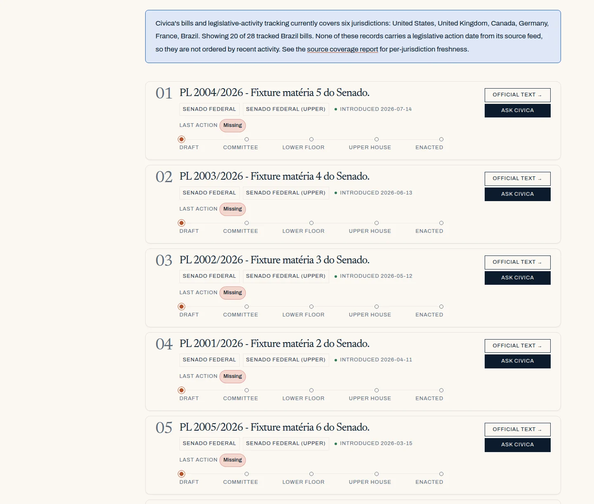
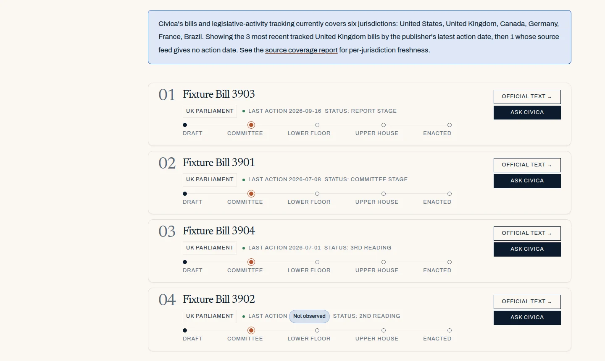
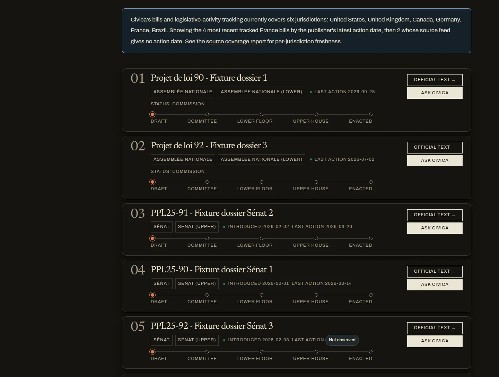

# DAT-038: bill last-action dates

Status: agent work complete; the task stays open. The code, schema migration,
fixtures, repair tool, synthetic rehearsal, and local browser check are done.
Nothing has been written to production. Every remaining step needs read-only
production access or the owner's written approval, and is queued in
`plan/MASTER-CHECKLIST.md` (DAT-038) and `plan/MANUAL-CHECKS.md`.

## The defect

Readers saw dates that were not legislative-action dates under "Last action".
Verified on 2026-09-28: `src/lib/bills/sources/camara-senado-br.ts` set every
Câmara bill's `lastActionDate` to the sync day ("use today as a conservative
ceiling"), and the live Brazil country page showed "Last action <today>". The
`bills.last_action_date` column was `NOT NULL`, which forced every adapter to
substitute something when its feed had no action date.

A read-only query (2026-09-28) found rows whose stored date equals their write
day: `camara_br` 2,579 (all), `congress_gov` 28, `data_assemblee_fr` 22,
`uk_parliament` 19, `bundestag_dip` 6, `legisinfo_ca` 2. That heuristic both
over- and under-counts. Same-day publisher events are genuine (the LEGISinfo
adapter never substituted a date, so its 2 rows are real). And the UK, DIP,
and Senado adapters stored a record-modified time for essentially every row,
whether or not it fell on the write day. The repair re-derives every row from
its retained payload instead of trusting the heuristic.

## Publisher field meanings

The container's network policy denied every publisher API host (and the
Wayback Machine), so live responses could not be fetched. Field meanings come
from each publisher's own published documentation, fetched 2026-09-29:

| Source | Former "last action" | What the publisher says | Correct field |
| --- | --- | --- | --- |
| Congress.gov (`congress_gov`) | `latestAction.actionDate`, else `updateDate`, else the sync day | `updateDate` is "the date of the last update received for the legislative entity … not a date corresponding to the legislative date or legislative action date"; `latestAction.actionDate` is "the date of the latest action taken on the bill or resolution" | `latestAction.actionDate`; absent → `missing` |
| UK Bills API (`uk_parliament`) | `lastUpdate`, else the sync day | `BillSummary.lastUpdate` is a date-time with no description; the list is sorted by it as `DateUpdatedDescending`, i.e. record update time. Sitting dates are `currentStage.stageSittings[].date` | latest sitting of the current stage on or before retrieval; none → `not_observed` |
| Bundestag DIP (`bundestag_dip`) | `aktualisiert`, else `datum`, else the sync day; `datum` was also stored as the introduction date | `aktualisiert`: "Letzte Aktualisierung der Entität" (record modified). `datum`: "Datierung des letzten zugehörigen Dokuments" (date of the latest associated document) | `datum`; none → `not_observed`. Introduction date: none in the list feed, so null |
| Câmara (`camara_br`) | the sync day | `/proposicoes` list items carry `id`, `uri`, `siglaTipo`, `codTipo`, `numero`, `ano`, `ementa` and no date; the latest step is `statusProposicao.dataHora` on `/proposicoes/{id}` | not in the feed Civica reads → `missing` (DAT-039 adds the per-bill field) |
| Senado (`senado_br`) | `DataUltimaAtualizacao`, else `DataApresentacao`, else the sync day | `/materia/atualizadas` lists matters whose data changed; `DataUltimaAtualizacao` is when the data was last updated by the system or its manager | not in the feed → `missing` (DAT-039); `DataApresentacao` stays the introduction date |
| Assemblée nationale (`data_assemblee_fr`) | latest `dateActe`, else the sync day | `dateActe` dates each legislative act | latest act on or before retrieval; none → `not_observed` |
| Sénat (`senat_fr`) | promulgation, else Constitutional Council decision, else deposit, else the sync day | the export dates deposit, decision, and promulgation only | promulgation or decision; deposit alone → `not_observed` (later steps are undated in the export) |
| LEGISinfo (`legisinfo_ca`) | latest bill event or reading | every field read dates a bill event or reading | unchanged; a bill with no dated event is kept as `not_observed` instead of failing the whole sync |

Documents, with SHA-256 of the retrieved bytes:

- Congress.gov: `LibraryOfCongress/api.congress.gov` `Documentation/BillEndpoint.md`
  (official Library of Congress API documentation), `9480a1595c46903140eae92e85a8bbcaf5b2d465222a53bbaf2b3685c159fc68`.
- Bundestag DIP: OpenAPI specification mirrored by `bundesAPI/dip-bundestag-api`
  (`openapi.yaml`; the same specification is served at dip.bundestag.api.bund.dev),
  `0624e0dc66b73671c5dcec3c6a90c26d9128e173e1c8e15b7ac8a9dd6fc72b1c`.
- UK Bills API: OpenAPI specification mirrored by APIs.guru
  (`APIs/parliament.uk/bills/v1/openapi.yaml`),
  `7add338f2e46c1d12ae6b68820003222b96a9c0672601d9fc58317d934e7f9b0`.
- Câmara and Senado: the official documentation pages
  (dadosabertos.camara.leg.br/swagger/api.html; www12.senado.leg.br/dados-abertos)
  as returned by web search, which also returned live `/proposicoes/{id}`
  pages showing `statusProposicao.dataHora`. The pages themselves were blocked.

Limits: the UK `lastUpdate` meaning is inferred from the schema and the sort
parameter, since the field has no description. The UK specification mirror may
lag the live API (it has no `introducedSittingDate`, which the adapter reads;
that field is unchanged here). DAT-039 must confirm the Câmara and Senado
per-item fields against live responses.

## What changed

- `src/lib/bills/last-action.ts`: the contract, closed statuses
  (`observed`, `missing`, `not_observed`), registered reasons, and the shared
  rule that a publisher date is taken as written and rejected if it is not a
  real date or falls after the retrieval day (one day of tolerance for
  publishers east of UTC).
- Each adapter exports a pure derivation from its raw record (`usLastAction`,
  `ukLastAction`, `dipLastAction`, `legisinfoLastAction`, `camaraLastAction`,
  `senadoLastAction`, `anLastAction`, `senatLastAction`). No adapter calls
  `new Date()` for a date value any more; sync entrypoints take an optional
  `retrievedAt` for fixtures. The unused legacy live-fetch helpers use the
  same derivations.
- Authoritative migration `0052_bill_last_action_date_state`:
  `last_action_date` nullable; `last_action_date_status` (default `observed`)
  and `last_action_date_reason`; CHECK constraints for the closed set, the
  date/state shape, and a non-empty reason (tested with `IS NOT NULL`
  explicitly, because `length(btrim(NULL)) > 0` is NULL and a CHECK accepts
  NULL; the same gap in the DAT-015 constraints is DAT-040); the last-action
  index becomes `DESC NULLS LAST`. Schema-only: existing rows stay `observed`.
- Writer (`upsert.ts`, `sync.ts`): validates the triple, writes and compares
  both new columns. A stored absence is stable, so Brazil rows are no longer
  rewritten every day.
- Reader (`FactbookBills.tsx`): an absent date renders "Last action" with the
  shared `DataValueState` chip (accessible name carries the reason). The
  banner (`billsListingNote`) says "most recent … by the publisher's latest
  action date" only for dated bills, and says plainly when none are dated.
- Query (`getBillsForJurisdiction`): dated bills first, newest first, then
  undated bills by introduction date, first-seen time, and id. `queries.ts` is
  an Index-protected file; the edit is registered as an exact Atlas-only
  normalization in `src/lib/ci/index-change-control.ts` with a test proving
  an adjacent edit still counts as Index drift. The function has no Index
  caller.
- Public API (`/api/countries/[slug]/bills`): `date` (null when absent),
  `dateStatus`, `dateStatusReason`.
- Data dictionary, source-coverage generator (new "Legislative action date"
  completeness measure for bills), migration registry and release notes,
  deployment-rehearsal scope, and APR-D175.

## Proof

| Command | Result |
| --- | --- |
| New fixtures on the new code: `node --import tsx --test src/lib/bills/sources/last-action-dates.test.ts` | 6/6 pass |
| Same fixtures on the pre-change adapters (scratch worktree at `0d615c6`) | 6/6 fail on the exact substitutions: `updateDate`, `lastUpdate`, `aktualisiert`, the sync day, a scheduled future act, the deposit date ([`old-adapters-fixture-run.txt`](old-adapters-fixture-run.txt)) |
| Bills suite incl. PGlite tests that apply the real `0052` SQL | 41/41, then 47/47 with the repair tests |
| Repair tests (`last-action-repair.test.ts`, PGlite) | 6/6: plan writes nothing and is byte-stable; apply runs once; replay and a new plan change nothing; drift in a target or non-target rolls back; tampered plan refused; unknown source or missing payload refuses to plan |
| Fresh PostgreSQL 16 from `0000`–`0051` | reproduces the checked production fingerprint `5b4e4b18…` exactly |
| Fresh `0000`–`0052` and `0051` upgraded with `0052` | identical new fingerprint `8bdb1e68…` (checked in) |
| `validate:claims-docs` (includes the full unit suite) | pass; 2,363 of 2,366 tests pass, 0 fail, 3 skipped |
| `tsc --noEmit`; ESLint on touched files | clean (one pre-existing warning at `queries.ts:393`) |
| `validate:` design-tokens, publisher-attribution, data-value-states, sync-freshness, production-adapters, cron-safety, migrations, authoritative-migrations, data-dictionary, source-coverage, research-evidence-retention, ui-pattern-map, design-composition, rendered-module-ledger, module-coverage, atlas-surface-data-matrix, route-io-policy, doc-references, source-input-manifest, raw-retention, derivation-versions, release-consistency, index-change-control, cache-consistency, query-budgets, secrets, ci-workflow | pass |
| `validate:migration-preflight` | **fails until the owner records two read-only live row counts** (below) |
| `validate:deps` | fails on upstream npm advisories (adm-zip and others); `package-lock.json` is unchanged by this task, so this predates it |

Full build: the whole `build:core` chain was run with only the preflight
gate removed; every other validator and `next build` passed. Along the way
the Atlas review packet was regenerated (`npm run generate:atlas-review-packet`)
because it pins the data dictionary's hash, which changed with the two new
columns; only that entry and the packet's own hash changed.

## Synthetic CLI rehearsal (2026-09-29)

Record: [`synthetic-cli-rehearsal-2026-09-29.json`](synthetic-cli-rehearsal-2026-09-29.json).
This proves the tool and its guards on real PostgreSQL. It is not the
production-copy rehearsal, which needs a read-only production snapshot.

A loopback PostgreSQL 16 database was built from the authoritative history at
`0051`, seeded with 46 bills stored exactly as the former adapters wrote them,
then migrated to `0052`. The repair CLI ran unmodified through its own Neon
HTTP client, routed to a loopback adapter kept outside the repository, using
the production guard path (`--production-host`).

- Refusals: plan before `0052`; a non-loopback host without `--production-host`;
  apply without an approval file; an approval file without the plan SHA-256;
  a wrong `--confirm` token.
- Plan `021c5423…`: 38 of 46 rows targeted (33 dates cleared, 5 replaced by the
  publisher's step date, 2 DIP introduction dates cleared). All 22 Câmara and
  6 Senado rows become `missing`; the genuine same-day Assemblée act and the
  genuine same-day LEGISinfo event are left alone.
- Apply: 38 rows in one transaction. Verify V1–V5 pass. A new plan proposes
  0 changes. Replaying the plan changes 0 rows. `updated_at` and
  `sources.last_sync_at` are unchanged.
- Second run (2026-10-06), after a scale fix: the plan now reads payloads in
  pages of 100 rows, and apply sends its targets once into a
  transaction-scoped temp table, so neither depends on a single large Neon
  HTTP request or response (Assemblée payloads carry whole act trees). On a
  fresh database seeded the same way, the plan SHA-256 was identical, apply
  changed 38 rows, verify passed, a new plan proposed 0, and replay changed 0.

## Browser check (2026-10-06)

Record: [`browser-check.json`](browser-check.json). `next dev` ran the branch
against the repaired rehearsal database (plus a locally seeded Index release
header so the page's fail-closed Index read could load). Playwright Chromium:

- Brazil, desktop and 390px, light and dark: the banner reads "Showing 20 of
  28 tracked Brazil bills. None of these records carries a legislative action
  date from its source feed, so they are not ordered by recent activity."
  Each bill shows "Last action" with a "Missing" chip; its accessible name
  gives the reason. 
- United Kingdom, desktop light: dated bills first by sitting date, then one
  "Not observed" bill whose current stage has no sitting yet.
  
- France, desktop dark: Assemblée and Sénat dates, then the undated dossiers.
  
- Also: `brazil-bills-desktop-dark.webp`, `brazil-bills-mobile-light.webp`,
  `brazil-bills-mobile-dark.webp`.
- No horizontal overflow. Console errors and failed requests are only
  environmental (external flag and photo hosts blocked by the container's
  network policy; dev-mode hot-reload websockets).
- The public API returns `date: null`, `dateStatus`, and `dateStatusReason`
  for the same rows.

Pre-existing issues seen but out of scope, already recorded by the EXP-001
review: CD-24 (stage labels run together on phones) and CD-15 (UK stage
mapping).

## Production sequence (owner-gated; not run)

Production is written only with the owner's explicit written approval.

1. Read-only, before merge: `npm run db:plan -- --id=0052_bill_last_action_date_state --live`
   and `npm run db:plan -- --id=data-repair-bill-last-action-dates --live`;
   merge both entries into `plan/evidence/DAT-013/preflight.json`. The build
   gate `validate:migration-preflight` fails until this is done, so CI and
   Vercel cannot build the branch before it.
2. Approved: apply `0052` with `npm run db:migrate` on a staging branch, then
   production, before the deploy that ships this code
   (`data/DEPLOYMENT-REHEARSAL.md`; Vercel builds never migrate). The new code
   selects the new columns and fails without them.
3. Merge and deploy. From the next sync on, each refreshed bill stores the
   corrected date state; rows not refreshed keep their old dates until step 6.
4. Read-only recovery snapshot (DAT-021 procedure).
5. Rehearse on an isolated restore of that snapshot: `repair:bill-last-action-dates`
   `--plan`, `--apply`, `--verify`, `--plan` again, replay `--apply`. Record
   `production-copy-rehearsal-<date>.json` (counts, hashes, plan SHA; no
   payload text). Expect every Câmara and Senado row to become `missing`.
   Check the UK counts: if the stored payloads lack `stageSittings`, every UK
   row becomes `not_observed`, which is correct for those payloads but worth
   knowing before apply.
6. Owner approval file `OWNER-APPROVAL-<date>.md` naming
   `bill-last-action-date-repair/v1`, the public-correction choice
   (`--public-correction=waived-prelaunch` under APR-D173, or an `in_review`
   correction record), and, appended after planning, the production plan
   SHA-256. Pause all cron jobs; confirm no bills cron lease is held.
   `--plan --production-host=<host> --out=<plan>`; compare with the rehearsal;
   `--apply --production-host=<host> --plan-file=<plan> --expected-plan-sha256=<sha>
   --release-id=<label> --public-correction=waived-prelaunch
   --approval-evidence=<file> --confirm=APPLY-<first 12 of sha>`;
   `--verify --plan-file=<plan>`; `--plan` again (expect zero). Re-enable cron
   jobs. Keep the plan file with the snapshot: `bills` has no history
   trigger, so its before-states are the compensation input.
7. Regenerate `src/lib/provenance/domain-coverage.generated.json` (it gains the
   action-date completeness measure), spot-check Brazil, the United Kingdom,
   Germany, and France pages, then check DAT-038 with a `PROGRESS.md` line.

Rollback: runtime code reverts normally, but after step 3 an old bills writer
fails closed on any row storing an absence, and an old reader sorts undated
bills first. Pause the bills crons before any Instant Rollback past this change
and prefer a forward fix. Data recovery is the step 4 snapshot or a reviewed
forward compensation (`data-repair-bill-last-action-dates-compensation`) built
from the plan's before-states.

## Follow-ups

- DAT-039: read Câmara `statusProposicao.dataHora` and the Senado tramitação
  date from the per-item endpoints so Brazil's bills get real action dates.
- DAT-040: the same NULL-reason gap in the DAT-015 value-state constraints on
  `country_facts`, `indicator_history`, and `country_metrics`.

## Cleanup

The loopback cluster, rehearsal database, plan/apply/verify files, Neon
adapter, seed script, and screenshots' source PNGs live outside the repository
and are deleted at the end of the session. No publisher payloads, credentials,
or production data entered the repository.
